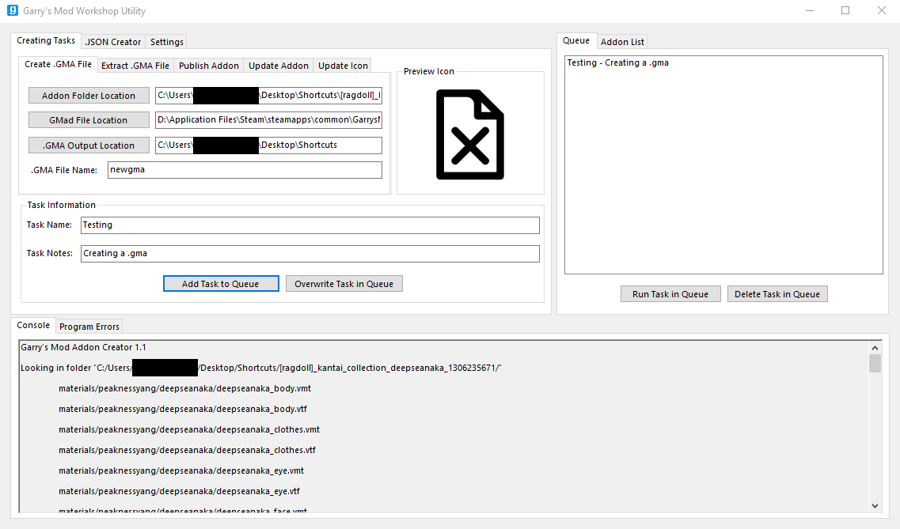

# GMWU (Garry's Mod Workshop Utility)

A C# program that is a work-in-progress re-write of [Garry's Mod Workshop Utility](https://github.com/TruthfullyHonest/Garrys-Mod-Workshop-Utility)

Current State:

Features:
- Create and extract .gma files, publish addons, update addons and icons
- Create .JSON files for addons
- See the progress of tasks through a console and an error window

Changes:
- Re-written code (Improvements in performance for many existing functions and better error handling and prevention)
- User-friendly design, done from scratch (including the consoles and re-sizing)
